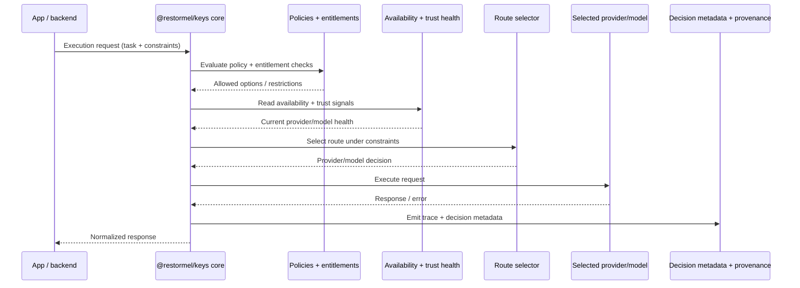
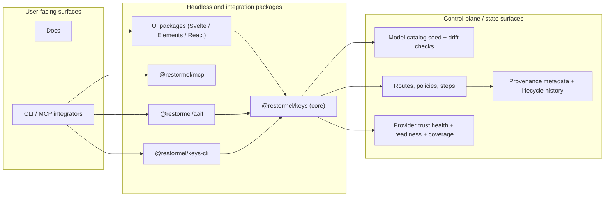

# Architecture

High-level architecture summary for Restormel Keys — a headless BYOK (Bring Your Own Key)
and provider-routing library for AI apps. UI, CLI, and MCP surfaces are thin wrappers around
one control plane; there's no hidden lock-in to a specific framework or database.

**Product shape:** REST API (Keys REST, `/keys/v1/*`) is the primary integration surface.
UI: `@restormel/keys-elements` (Web Components). CLI: `@restormel/keys-cli`, `@restormel/doctor`.
Agents: `@restormel/mcp`, `@restormel/aaif`. `@restormel/keys`, `@restormel/keys-svelte`, and
`@restormel/keys-react` are deprecated (maintenance-only until 2026-12-01) — use Keys REST
for new integrations.

**Repo shape:** pnpm monorepo. `packages/` — routing core, UI packages (Svelte/Elements/React),
CLI (`keys-cli`, `doctor`, `validate`), agent surfaces (`aaif`, `mcp`), supporting packages
(`contracts`, `observability`, `context-packs`, `state`), graph packages, and the
`testing-*` family. `apps/` — small demo and reference apps only (the hosted dashboard/control
plane is a separate, not-yet-open-sourced product — see [STATUS.md](STATUS.md)). `docs/`,
`examples/`, `scripts/`, `skills/`, `subagents/` — documentation, runnable examples, and
repo tooling.

**Data & self-hosting:** the client packages (`keys-cli`, `keys-elements`, `mcp`, etc.) are
transport clients — they don't require a database. If you self-host the control plane behind
Keys REST, Postgres is required and **Neon is the documented, recommended provider** — see
[NEON.md](NEON.md) for why, and
[docs/guides/database-neon-for-self-hosters.md](docs/guides/database-neon-for-self-hosters.md)
for the setup guide (schema, Neon Auth, CI preview branches).

## How a routing decision flows

## Package relationships

See [docs/decisions/](docs/decisions/) for the architecture decision records behind these
choices.
