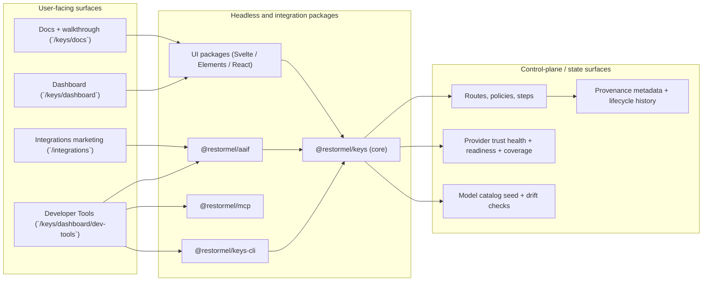
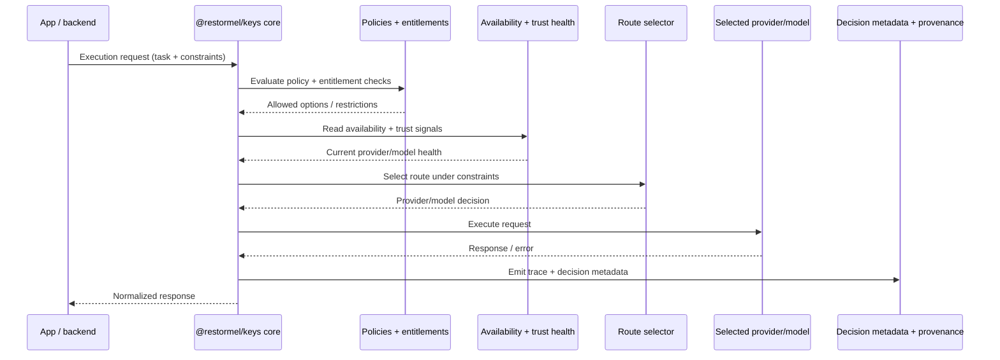

# Architecture

High-level architecture summary. **Single entry point** for structure; details live in [docs/](docs/) and [docs/decisions/](docs/decisions/).

**Product shape:** REST API (Keys REST, `/keys/v1/*`) = primary integration surface. UI: `@restormel/keys-elements` (Web Components). CLI: `@restormel/keys-cli`, `@restormel/doctor`. Agents: `@restormel/mcp`, `@restormel/aaif`. Dashboard, site, billing, and hosted runtime shipped. `@restormel/keys`, `@restormel/keys-svelte`, and `@restormel/keys-react` are deprecated (maintenance-only until 2026-12-01) — use Keys REST for new integrations.

**Repo shape:** Monorepo (pnpm). `packages/` (core, svelte, elements, react, cli, doctor, validate, **aaif**, **mcp**, **contracts**, **observability**, **context-packs**, **state**, graph packages, Testing packages), `platform/` (CI composites, cursor template, module template sources — not the tokens package), `apps/` (dashboard — single SvelteKit app for Keys landing, docs/walkthrough with optional agent prompts, **Integrations landing** at `/integrations`, and dashboard; **demo-next** Next.js sample is source-only / local verify, not CI; demo-svelte; site archived), `docs/`, `scripts/`, `prompts/`, `skills/`, `subagents/`. **Restormel State:** `@restormel/state` — [docs/restormel/RESTORMEL-STATE.md](docs/restormel/RESTORMEL-STATE.md). **Design tokens:** `@restormel/keys-tokens` from **npm** in dashboard; source repo [restormel-platform](https://github.com/Allotment-Technology-Ltd/restormel-platform). **New Restormel modules** (outside this repo): default stack in [docs/restormel-module-default-stack.md](docs/restormel-module-default-stack.md). **npm install scope** (headless vs UI, pnpm workspaces): [docs/reference/npm-packages.md](docs/reference/npm-packages.md).

**Phase 01:** Implementation. Keys (control plane) + Connect (Ingest · Retrieve · Verify) are the MVP; Testing and Graph are flag-off. See [STATUS.md](STATUS.md) and [docs/product/positioning.md](docs/product/positioning.md).

**Hosting:** UK/EU self-host on **Coolify**; **Forgejo-native** CI (migrated off GitHub Actions/Vercel, cutover 2026-06-13). **Neon Postgres** (spine) + **BYO SurrealDB** (graph); **PostHog EU** analytics; **Zuplo** Cloud API gateway; **Paddle** billing. Runbooks: [docs/infra/](docs/infra/).

**Trust/security:** Verified-context first — evidence-bound verification (quoted span + source-version hash, deterministically re-checkable), cross-model entailment with abstention, and exportable provenance traces — with **BYOK custody** on every LLM stage. [docs/product/positioning.md](docs/product/positioning.md), [docs/verified-context-claims-ledger.md](docs/verified-context-claims-ledger.md), [docs/security-baseline.md](docs/security-baseline.md), [docs/threat-model-starter.md](docs/threat-model-starter.md).

**Design system:** All UI (site, dashboard, embeddable components, demos) aligns with [docs/design-system-index.md](docs/design-system-index.md). Tokens and components from DESIGN-TOKENS.md, DESIGN-SPECIFICATION.md, COMPONENT-INVENTORY.md; reference CSS in docs/design-tokens.css (keep aligned with npm). **Dashboard** imports base tokens from **`@restormel/keys-tokens`** (npm). Drift check: `pnpm run check-token-drift`. **Platform subtree:** [platform/](platform/) holds reusable CI composites, Cursor template, and module template sources; token **source** in [restormel-platform](https://github.com/Allotment-Technology-Ltd/restormel-platform). See [docs/platform-modularization.md](docs/platform-modularization.md).

**Catalog vs library (hybrid):** OpenAI, Anthropic, and Google model IDs in `defaultProviders` are checked against `apps/dashboard/data/model-catalog-seed.json` in CI (`pnpm run check:catalog-drift`). See [docs/reference/catalog-governance.md](docs/reference/catalog-governance.md).

**Reintegration and shell contracts:** Keys is headless-core-first with explicit shell contracts so the wider Restormel suite can share standards without forcing runtime convergence. Contracts are documented and enforced as follows:

- **Tokens:** Base canonical tokens → semantic surface tokens (`--rm-*` brand/app/docs, `--rk-*` embed) → optional component tokens. See [docs/design-system-index.md](docs/design-system-index.md) and **`@restormel/keys-tokens`** (npm) / [restormel-platform](https://github.com/Allotment-Technology-Ltd/restormel-platform).
- **Navigation and copy:** Canonical URLs (Dashboard → `/keys/dashboard`, Sign in → `/keys/dashboard/login`) and product nouns/CTA grammar are mandatory across all surfaces. See [docs/ux-contracts.md](docs/ux-contracts.md) and [docs/documentation-strategy.md](docs/documentation-strategy.md).
- **State:** Loading, error, empty, success and recovery actions are required for user-facing flows. See [docs/ux-contracts.md](docs/ux-contracts.md).
- **Documentation:** Single coherent doc journey and same-link rule for site, docs, dashboard, and runbooks. See [docs/documentation-strategy.md](docs/documentation-strategy.md).

Upstream or sibling products that integrate with Keys should use these contracts (same URLs, same terms, token alignment) for a consistent experience. Keys product framing does not change for reintegration.

**Integrations layer:** `@restormel/aaif` (request/response types + runtime helper `executeAAIFRequest` for routing + cost estimation), `@restormel/mcp` (MCP tool schemas + stdio server `restormel-mcp` and `createRestormelMcpServer()`). Optional MCP → cloud wiring uses two distinct bases: **Dashboard API** full URL for policy evaluate (`entitlements.check`, e.g. `…/keys/dashboard/api/policies/evaluate`) and **dashboard app base** for `/api/projects/…` control-plane style tools (`https://restormel.dev/keys/dashboard` on hosted). Canonical operator journey: [docs/runbooks/mcp-implementation-workflow.md](docs/runbooks/mcp-implementation-workflow.md). Marketing at `/integrations` (top-level route, separate from `/keys/`, designed for future extraction). Dashboard **Connections** at `/keys/dashboard/integrations` (hosted encrypted provider keys and/or vault references; masked in API/UI), **Restormel Testing** hub at `/keys/dashboard/testing` (project/env IDs, env snippets), and **Developer Tools** at `/keys/dashboard/dev-tools`. Keys + Testing onboarding: [docs/keys-testing-onboarding.md](docs/keys-testing-onboarding.md). Full spec: [docs/integrations/INTEGRATIONS-FULL-SPEC.md](docs/integrations/INTEGRATIONS-FULL-SPEC.md).

**Keys routing contract (SOPHIA-class):** Single canonical doc [docs/keys-routing-contract.md](docs/keys-routing-contract.md) — resolve `stepChain`, ingestion `workload`/`stage`, simulate diagnostics, MCP topic `keys_routing_contract`, in-product [/keys/docs/guides/routing-contract](https://restormel.dev/keys/docs/guides/routing-contract). Phase F (2026-04-16): model pools on `route_steps`, parallel metadata echoes, diagrams under [docs/routing/](docs/routing/).

**Operator APIs and provenance:** Dashboard runtime/control-plane now includes provider trust health, route coverage and readiness advisory APIs, route recommendation previews, and policy lifecycle parity (`history/publish/rollback/diff`). Route/policy write paths include provenance metadata (`updatedVia`, `updatedBy`, `updatedAt`, `changeSummary`, `contentHash`) for auditable sync and rollback workflows.

**Dashboard UI simplification:** Optional env **`RESTORMEL_DASHBOARD_UI_HIDDEN`** hides listed control-plane sections from the in-browser dashboard (nav, deep links, onboarding shortcuts); **HTTP APIs stay enabled** for operators and automation. See [apps/dashboard/README.md](apps/dashboard/README.md).

**Extraction seams:** When Integrations moves to its own repo: (1) `src/routes/integrations/` lifts into a new SvelteKit app, (2) `packages/aaif/` and `packages/mcp/` move as-is, (3) dashboard dev-tools section stays in dashboard app (shared auth/shell), (4) shared components (`IntegrationCard`, `StatusBadge`) move with the marketing page or into a shared package. **Status:** deferred; tracked from [docs/platform-modularization.md](docs/platform-modularization.md).

## Architecture diagrams (summary)

---

*Record decisions in docs/decisions/. Keep this file as summary only.*
