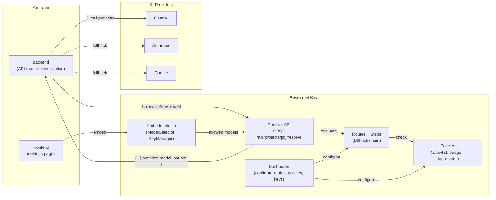

# Walkthrough — Docs IA and Navigation

> **Status:** Proposed. This document defines the information architecture for the "Walkthrough" section of the Restormel Keys public docs.

---

## 1. Where it sits in the docs

The Walkthrough is a new top-level section sitting between "Start here" (existing conceptual docs) and "Reference" (existing API/CLI/config reference). It is the primary onboarding journey for any developer integrating Restormel Keys into an existing app.

```
restormel.dev/keys/docs/

Start here                          ← existing
  Overview
  Framework compatibility
  Cloud API

Walkthrough                         ← NEW
  Before you begin                  ← entry page (prerequisites, what you'll build)
  Phase 0 — Inventory your routing  ← audit + retire custom routing
  Phase 1 — Install and configure   ← packages, env, project in dashboard
  Phase 2 — Resolve your first model← one resolve call, verify it works
  Phase 3 — Add routes and fallbacks← multi-step routing in dashboard
  Phase 4 — Apply policies          ← allowlists, deprecation, budgets
  Phase 5 — Embed the UI            ← ModelSelector, KeyManager in your app
  Phase 6 — Go live                 ← parallel run, cutover, verify
  Migration paths                   ← LiteLLM / Portkey / OpenRouter / custom

Reference                           ← existing
  API reference
  CLI reference (keys doctor, validate, etc.)
  Configuration reference
  Provider reference
```

### Entry points into the Walkthrough

| Coming from | Lands on | Why |
|-------------|----------|-----|
| Docs home ("Get started") | Before you begin | Primary CTA |
| Framework compatibility page | Phase 1 — Install | "Ready to integrate?" link at bottom |
| Cloud API page | Phase 2 — Resolve | "Use the resolve endpoint in your app" |
| Dashboard onboarding checklist | Phase 1 or Phase 3 | Dashboard links into walkthrough steps |
| Pricing page (post-signup) | Before you begin | "Start integrating" CTA |

### Exit points from the Walkthrough

| Walkthrough page | Links out to |
|------------------|--------------|
| Phase 1 | CLI reference (`keys init`, `keys doctor`) |
| Phase 2 | API reference (resolve endpoint schema) |
| Phase 3 | Dashboard (Routes UI), Cloud API docs |
| Phase 4 | Dashboard (Policies UI), API reference (evaluate endpoint) |
| Phase 5 | Framework compatibility, Component reference (KeyManager, ModelSelector props/events) |
| Phase 6 | CLI reference (`keys validate`), Dashboard (logs/analytics) |
| Migration paths | Existing docs for LiteLLM, Portkey, OpenRouter (external links) |

---

## 2. Page map with purposes

| # | Page slug | Page title | Purpose | Estimated length |
|---|-----------|------------|---------|------------------|
| 0 | `walkthrough/` | Before you begin | Prerequisites, what you'll build, mental model, key terms | Short (1 screen) |
| 1 | `walkthrough/phase-0-inventory` | Phase 0 — Inventory your routing | Audit existing custom routing/model selection; decide what to remove, keep, or wrap | Medium |
| 2 | `walkthrough/phase-1-install` | Phase 1 — Install and configure | Install packages, create project in dashboard, set env vars, run `keys doctor` | Medium |
| 3 | `walkthrough/phase-2-resolve` | Phase 2 — Resolve your first model | Make one resolve call from your backend, see the result, understand the response | Short–Medium |
| 4 | `walkthrough/phase-3-routes` | Phase 3 — Add routes and fallbacks | Create a route with steps in the dashboard, configure fallback chain, test failover | Medium |
| 5 | `walkthrough/phase-4-policies` | Phase 4 — Apply policies | Add model allowlist, deprecated-model block, budget cap; test policy enforcement | Medium |
| 6 | `walkthrough/phase-5-ui` | Phase 5 — Embed the UI | Add ModelSelector and/or KeyManager to your app; wire events to your backend | Medium |
| 7 | `walkthrough/phase-6-go-live` | Phase 6 — Go live | Parallel run strategy, traffic shifting, cutover, post-cutover verification | Medium |
| 8 | `walkthrough/migration-paths` | Migration paths | Strangler patterns for LiteLLM, Portkey, OpenRouter, and custom routing | Medium–Long |

---

## 3. End-to-end flow diagram



**Reading the diagram:**

1. Your backend calls the Resolve API before each AI request.
2. Resolve evaluates the route's steps (fallback chain) against active policies.
3. You get back a provider, model, and key source — then call the provider directly.
4. Your frontend embeds ModelSelector (and optionally KeyManager) so users pick models within policy constraints.
5. Everything is configured in the Dashboard: routes, steps, policies, keys.

---

## 4. Cross-link map (walkthrough ↔ existing docs)

This table ensures every walkthrough page links to (and is linked from) the right existing docs. Use these when writing each page.

| Walkthrough page | Must link TO | Should be linked FROM |
|------------------|-------------|----------------------|
| Before you begin | Framework compatibility, CLI reference, Dashboard | Docs home, Pricing, Framework compatibility |
| Phase 0 | sophia-integration.md (as reference pattern), Dashboard | — |
| Phase 1 | CLI reference (`keys init`, `keys doctor`), Framework compatibility, Dashboard (create project) | Framework compatibility ("Next: integrate") |
| Phase 2 | API reference (resolve endpoint), Cloud API, Zuplo setup | Cloud API ("Try resolve in your app") |
| Phase 3 | Dashboard (Routes UI), API reference (routes schema) | — |
| Phase 4 | Dashboard (Policies UI), API reference (evaluate endpoint, policy types) | — |
| Phase 5 | Framework compatibility (package choice), Component reference (props, events, theming) | Framework compatibility ("Embed UI") |
| Phase 6 | CLI reference (`keys validate`, `keys doctor`), Dashboard (logs) | — |
| Migration paths | LiteLLM docs (external), Portkey docs (external), OpenRouter docs (external) | — |

---

## 5. Dashboard onboarding checklist integration

The existing dashboard at `restormel.dev/keys/dashboard` has an onboarding checklist. Each checklist item should deep-link into the corresponding walkthrough page:

| Dashboard checklist item | Links to walkthrough page |
|--------------------------|--------------------------|
| "Create your first project" | Phase 1 — Install and configure |
| "Generate an API key" | Phase 1 — Install and configure |
| "Configure a route" | Phase 3 — Add routes and fallbacks |
| "Add a policy" | Phase 4 — Apply policies |
| "Make your first resolve call" | Phase 2 — Resolve your first model |
| "Embed UI in your app" | Phase 5 — Embed the UI |

---

## 6. Navigation UX notes

- **Progress indicator:** Each walkthrough page should show a lightweight step indicator (e.g. "Step 3 of 8") so the reader knows where they are and how much remains.
- **Previous / Next:** Every page has prev/next navigation at the bottom pointing to the adjacent walkthrough pages.
- **"Skip to…":** The entry page ("Before you begin") should have a "Skip to…" section for readers who already have parts done (e.g. "Already installed? Skip to Phase 2").
- **Time estimates:** Each page should show an estimated time (e.g. "~10 minutes") so readers can plan.
- **Agent-friendly structure:** Consistent heading hierarchy (H1 = page title, H2 = major sections, H3 = steps) so coding agents can parse walkthrough content reliably.

---

## 7. Relationship to existing docs

This walkthrough does **not** replace existing docs. It is an opinionated, linear path through them:

- **Framework compatibility** remains the reference for "which packages do I install for my stack."
- **API reference** remains the canonical endpoint/schema documentation.
- **CLI reference** remains the canonical command documentation.
- **Cloud API** remains the gateway/Zuplo reference.
- **sophia-integration.md** and **sophia-dogfooding-plan.md** remain internal reference docs (not linked from public walkthrough, but their patterns inform the walkthrough content).

The walkthrough is the **"happy path"** that stitches these together into a sequential integration journey.

---

*Next file: `01-writing-style-guide.md` — terminology, voice, and formatting conventions for the walkthrough.*
