# 08 · Artefact guide — what each reference is, and why

This doc exists so the coding agent understands **what it is looking at and why it looks that
way** — not just *what* to build, but the reasoning that produced each decision. Read it
alongside `01_CONCEPT.md` (the lessons) and `03_SCREENS.md` (the specs).

## How to treat these artefacts

> **The artefacts encode _intent_, not implementation.** They were made in HTML/React because
> that is the fastest way to think in pixels and interactions — not because the markup is the
> answer. The valuable, durable thing in each file is the **decision** it captures: the order of
> steps, the honesty of a state, the framing of a choice, the one-true-CTA.
>
> When the real codebase or API forces a different mechanic than a mock shows, **keep the intent
> and adapt the mechanic** — then leave a code comment noting the deviation and which artefact it
> came from. Examples of intent worth protecting even if the implementation must change:
> - models are chosen **at ingest**, never retroactively (artefact: `M1 Add Models.html`);
> - failure **stops and names the stage** (artefact: `M1 Flow.html` run console);
> - connecting your own DB is **non-destructive and reversible** (artefact: `M3 Flow.html`);
> - "Connect" is **one area, many connection shapes** (artefact: `M4 Connections.html`).
>
> If a mock contradicts how the data actually works, the data wins — but the *experience goal*
> (the aha, the honesty, the safety) should survive the change. When in doubt, preserve the
> feeling the screen is trying to create and flag it for design review.

Each artefact below lists: **what it is · what it captures · why it is like that · how to use it.**
Screenshots of every artefact are in `screenshots/` (referenced inline).

---

## A. The canonical reference — build from this

### `designs/Restormel Prototype.html` (+ `proto-app.jsx`, `styles.css`)
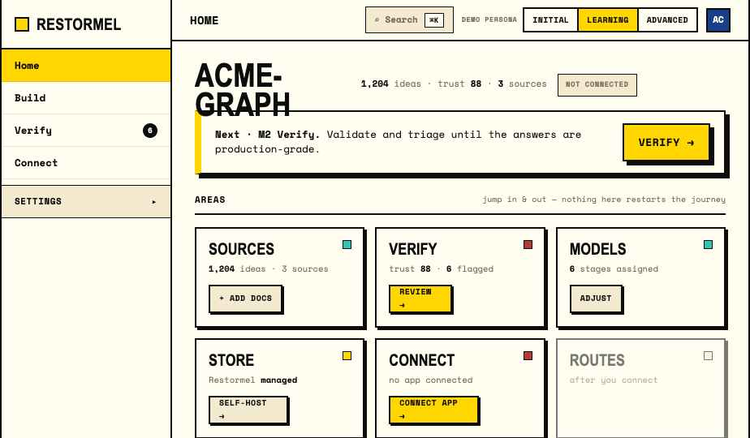

- **What it is:** the end-to-end **clickable** prototype. The real shell (sidebar + topbar), the
  persistent **graph home**, and all five milestones, walkable as the three personas via the
  "Demo persona" switch in the topbar.
- **What it captures:** the *whole* system working together — navigation, state persistence
  (localStorage), the one-next-action logic on home, and how a milestone returns you home.
- **Why it is like that:** it is the synthesis of every other artefact after all the lessons in
  `01_CONCEPT.md` were applied. It is the most up-to-date source of truth for flow and copy.
- **How to use it:** this is **the** file to recreate in Svelte. Switch persona and walk each
  path. The state shape in `proto-app.jsx` (`graph` + `progress` + `persona`) ports directly —
  see `05_STATE.md`. **Do not port the React;** `06_SVELTE.md` is the translation. `styles.css`
  is the design-system stylesheet the mocks share — it mirrors your real token layer
  (`04_TOKENS.md`); reuse the codebase's, don't copy this.

---

## B. Per-milestone studies — the detail behind each screen

These are focused, mostly-static studies of one milestone each. They predate the final prototype
and go **deeper on copy, states, and edge cases** than the prototype has room to. Use them as the
spec for a screen while you build that screen; where a study and the prototype differ, the
**prototype wins on flow**, the **study wins on state coverage and microcopy**.

### `designs/M1 Flow.html` — Build (ingest), incl. the run console
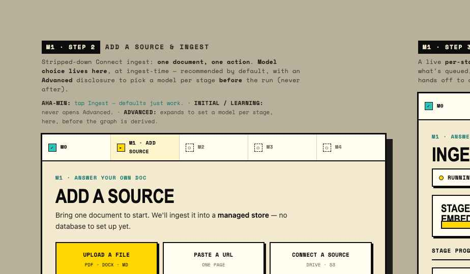

- **Captures:** the 4-step ingest (Sources → Configure → Ingest → Ask) and especially the
  **per-stage run console** with honest states (done / active / queued) and the **failure /
  rate-limit / bad-key** edge states.
- **Why:** M1 is the conversion moment and the most complex screen — it earned the most detail.
  The honesty of the run console (lesson 6) is the whole point: no fake progress, name the stage
  that fails. **Build this screen first.**

### `designs/M1 Add Models.html` — model choice at ingest
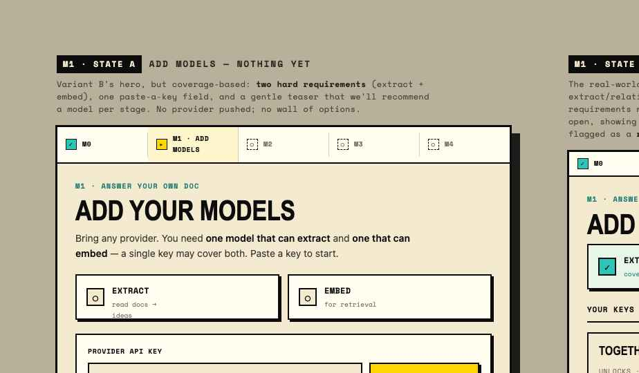

- **Captures:** the *"Advanced: choose a model per stage"* disclosure that lives **inside** the
  ingest step, defaulting to recommended models.
- **Why:** this is the artefact for **lesson 1 — order config before the work it configures.**
  An earlier version put a model table in a *later* milestone, which wrongly implied you could
  re-pick models ingestion had already run on. This file is the corrected mental model: models
  are decided here, once, before the run.

### `designs/M2 Make Ready.html` — the make-ready hub (trust gates)
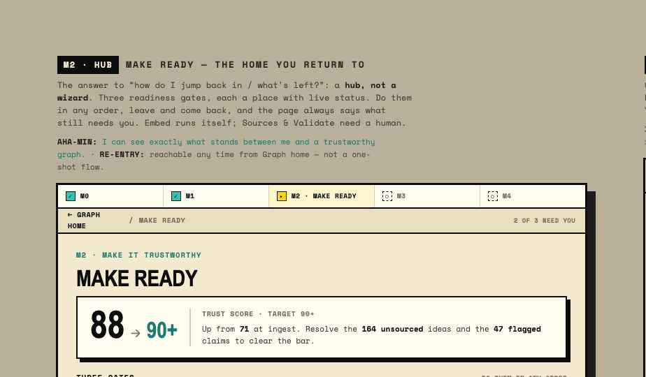

- **Captures:** the **trust meter** + the **three readiness gates** (Sources / Embed / Validate)
  each with an honest status (done·auto / needs-you / needs-review).
- **Why:** lesson 3 — decompose a vague "make it ready" into concrete, honest gates that feed one
  number. It also embodies lesson 8: this is a **screen** (revisitable, with status), not a modal.

### `designs/M2 Sub-Screens.html` — Sources / Embed / Validate detail + triage
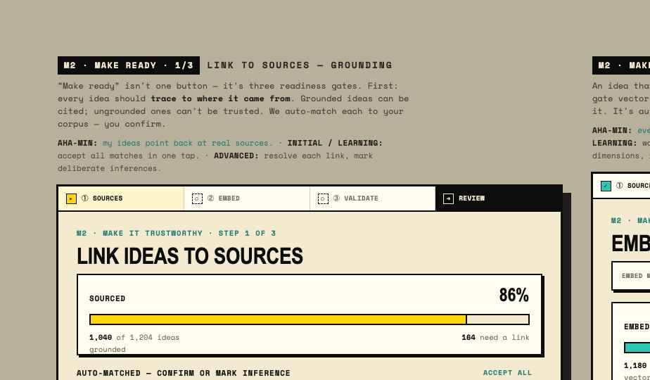

- **Captures:** the three gate detail screens, and the **triage** interaction (Accept / Weaken /
  Unsupported on flagged claims) that drives the trust score to production-grade.
- **Why:** the gates need somewhere to go when opened. Triage is the user's actual work in M2;
  this file is its spec.

### `designs/M3 Flow.html` — Store (own your stack), the safe path
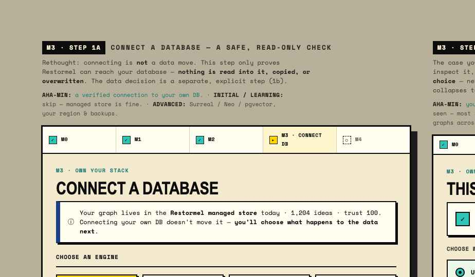

- **Captures:** the 3-step own-your-store flow (Connect → Data → Keys), the **read-only verify**
  handshake, and the **non-destructive data choice** when the target DB isn't empty (use / add /
  keep separate) with the "nothing is deleted, switch back anytime" guarantee.
- **Why:** lesson 7 — destructive-sounding actions need explicit safety framing. M3 is advanced-
  only and must never feel like it could nuke a customer's database. Also the home of the
  "production keys, framed forward-looking" correction from lesson 1.

### `designs/M4 Connect.html` — first-connection wizard
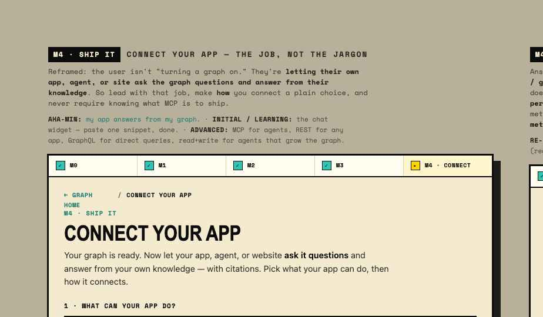

- **Captures:** the 3-step wizard (Type → Access → Name) with a **live preview panel** that
  builds up, type cards with **icons** (chat / plug / API / SDK / GraphQL — not big letters), and
  plain-language **read vs read+write**.
- **Why:** lessons 4 & 5 — "Connect" is one concept with many shapes, and access is explained in
  human terms. The icon decision came from a specific note in-session that single-letter avatars
  read poorly; the fix is documented here.

### `designs/M4 Connections.html` — the connections manager
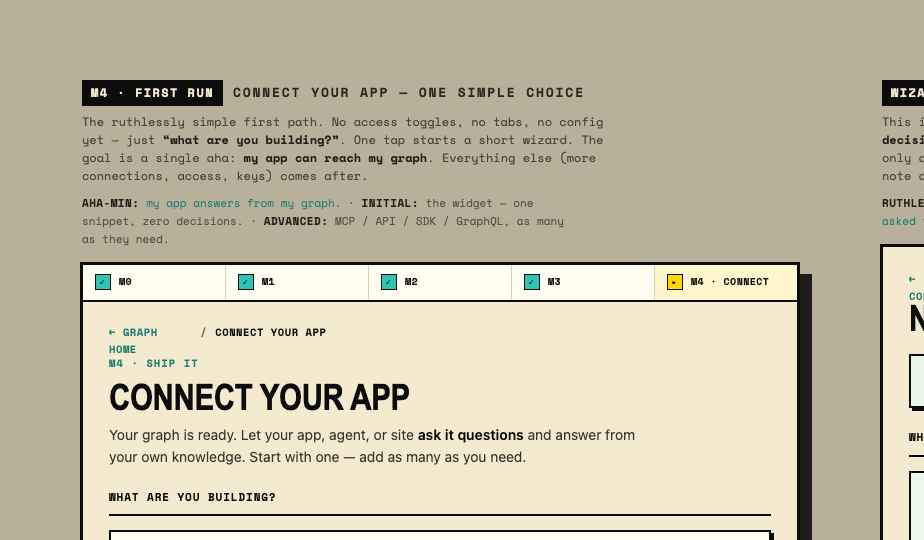

- **Captures:** the **list of many connections** (each with type icon, access badge, endpoint,
  status), plus add / configure / **delete** (danger zone) and the connection detail view.
- **Why:** lesson 4 again — after the first connection it is a manager, not a wizard, because real
  users hold several (e.g. a read-only agent *and* a read+write backend). This replaced an earlier
  scattering of serving across "Prove / Agents / Gateway keys".

### `designs/M2 Flow.html` & `designs/M4 Flow.html` — earlier milestone flow studies
- **Capture:** earlier, journey-framed passes at M2 and M4 with extra annotation about *which
  persona needs what* at each step.
- **Why included:** good for **copy and state coverage** and to show how the thinking evolved.
  Where they differ from `M2 Make Ready.html` / `M4 Connect.html`, the newer files win — but these
  carry rationale notes worth reading once.

---

## C. Strategy & structure — why the journey is shaped this way

These are not screens to build; they are the **reasoning** behind the build. Read them to
understand decisions before you change anything structural.

### `designs/Onboarding Journey.html` — the learning-journey ladder
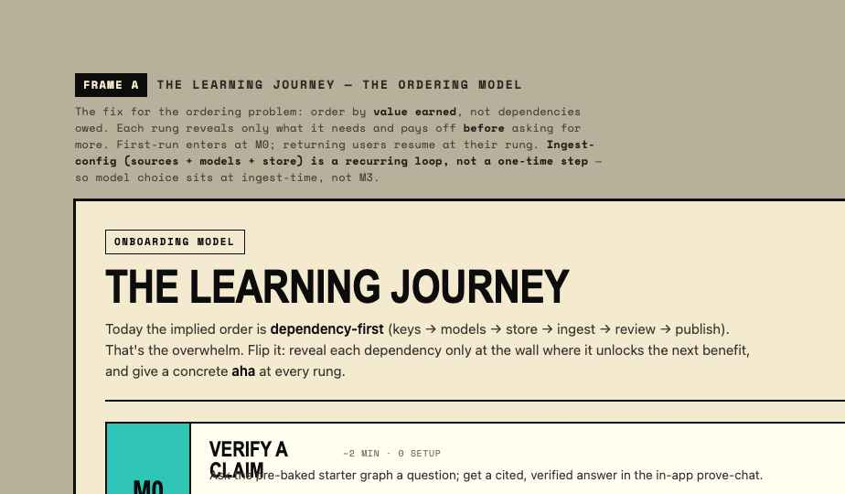

- **Captures:** the five milestones as a ladder — for each rung, the user's **need**, the **aha**,
  the **gate**, and what it **reveals** next — plus first-run vs returning-user home frames.
- **Why:** this is the source diagram for "sequence ahas, not features" (`01_CONCEPT.md` §2) and
  for the persistent-home model (§4). If you're tempted to reorder milestones, start here.

### `designs/Journey Storyboard.html` — journey mapped to actual screens
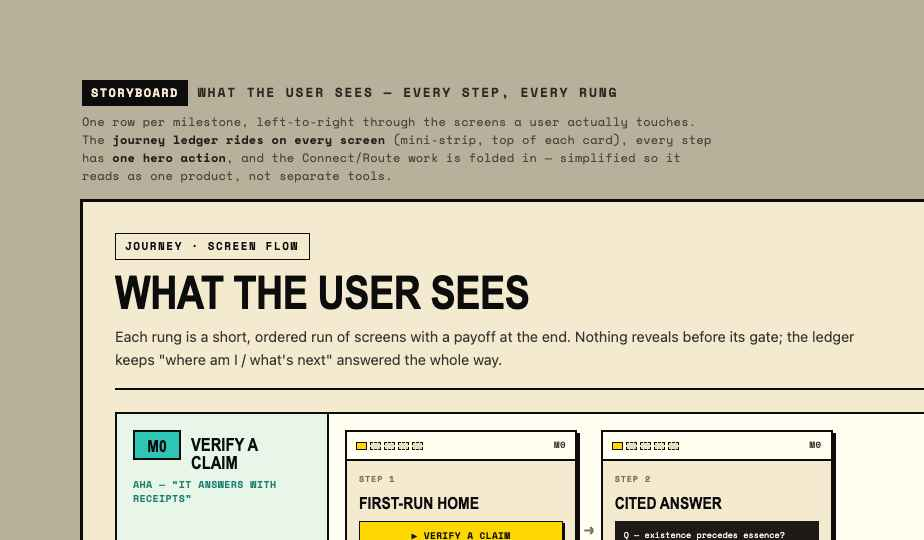

- **Captures:** each rung tied to the concrete screens a user sees, end to end.
- **Why:** bridges the abstract ladder and the literal screens — useful when you need to see the
  whole arc in one view while building any single screen.

### `designs/Archetype Analysis.html` — personas × screens matrix
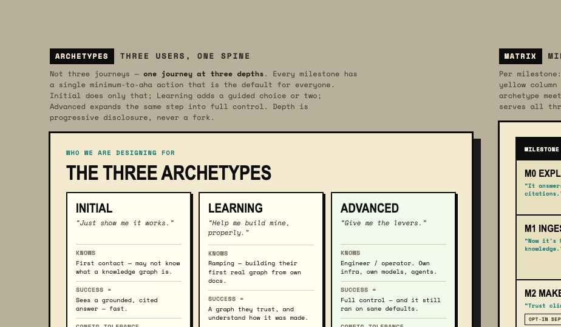

- **Captures:** per-screen **"minimum to aha"** and what **Initial / Learning / Advanced** each
  need from it; and the matrix showing the **mandatory spine (M0→M1→M4)** with M2/M3 as opt-in
  depth (the yellow spine column).
- **Why:** this is the artefact for the **persona model** (`01_CONCEPT.md` §3) and the single most
  important structural rule: **build the spine first, layer depth after.** When you decide what to
  ship in a first cut, this tells you what every persona must have vs what's optional.

### `designs/Navigation Model.html` — the final, simplified IA
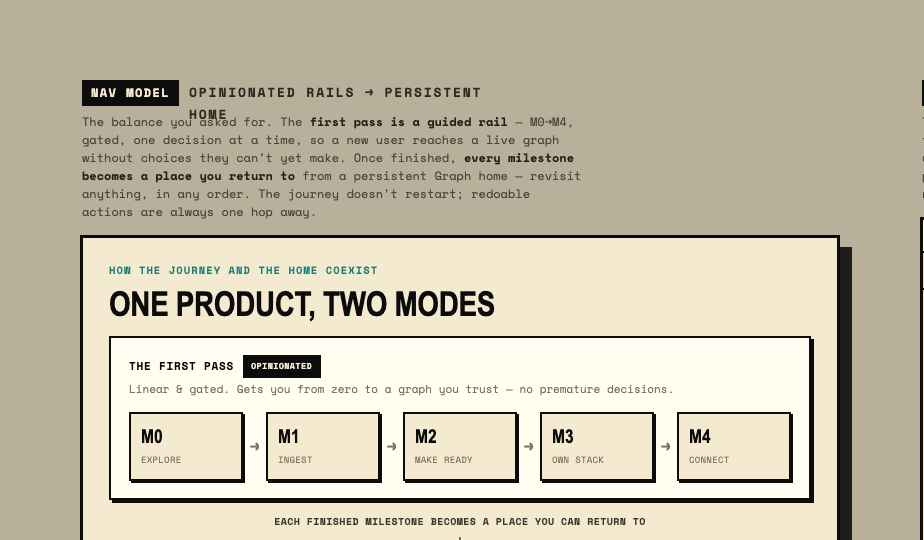

- **Captures:** the **ruthless-efficiency** nav pass — from ~13 destinations down to a **4-item
  spine (Home · Build · Verify · Connect)** plus a tucked **Settings** group (Providers, Store,
  Routes, Audit, Metrics), and the "redoable actions re-enter their area" model.
- **Why:** lesson 9. This is the authority for `02_IA_AND_NAV.md`. The principle to preserve:
  *occasional config does not earn top-level nav.* If the real app has more sections than this,
  push them into Settings rather than widening the spine.

---

## D. Redesign studies — the "before → after" decisions

These two files exist to show a **decision being made** (an earlier treatment and the reasoning
that replaced it). They're the clearest record of *why* a screen changed.

### `designs/Route Redesign.html`
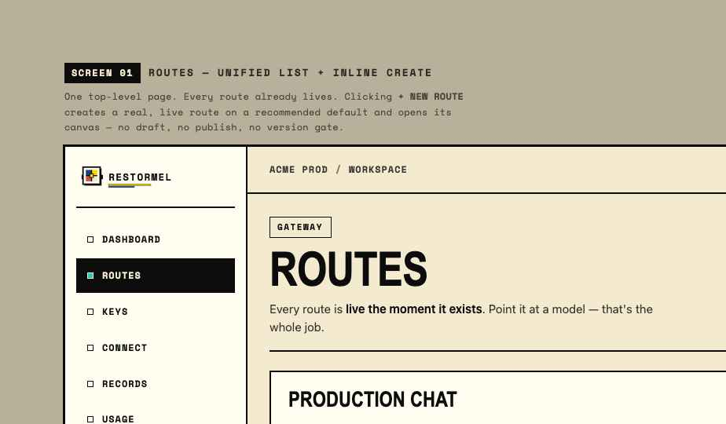
- **Captures:** the routes screen rework — autosave (SAVING→SAVED) instead of an explicit publish,
  primary/connector/fallback model, steps born disabled with a stated reason.
- **Why:** routes are config, not a publish event; the redesign removed a false "publish" ceremony.

### `designs/Connect Redesign.html`
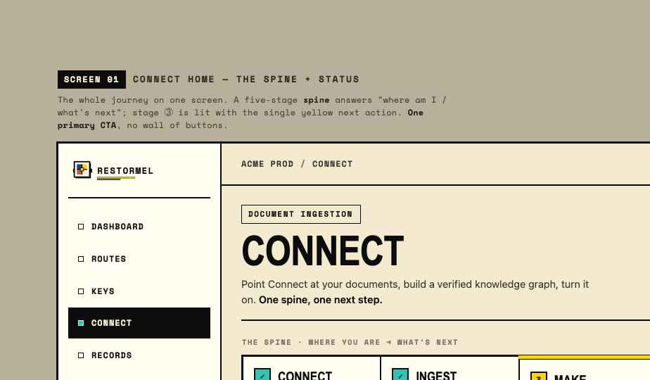
- **Captures:** the consolidation of serving (Prove / Agents / Gateway-keys) into the single
  **Connect** area, and the reframing of "publish routes" into "turn your graph on (MCP)".
- **Why:** the seed of lesson 4. Read this to understand why Connect is one area, not three.

---

## E. The alternative bet — captured, not built

### `designs/Plan B - Autopilot.html`
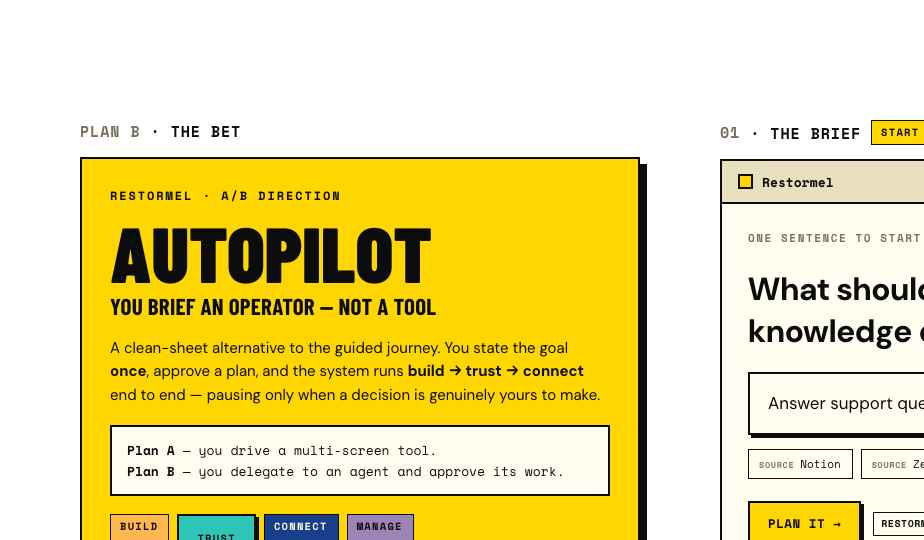

- **Captures:** a radically different model — you **brief an operator** once and the system runs
  the whole spine, pausing only for decisions that truly need a human, auditing itself for trust.
  Intro + 7 frames + an **A/B contrast table** naming the bet each plan makes.
- **Why:** captured so the vision isn't lost and we have a clean A/B framing later. **Explicitly
  out of scope for this build** (`01_CONCEPT.md` §7). Do **not** implement it; it's a north star.

---

## Decision → artefact → doc (provenance map)

When you want to know *why* something is the way it is, this maps each major decision to the
artefact that shows it and the doc that explains it.

- **Sequence ahas, not features** → `Onboarding Journey.html` → `01_CONCEPT.md` §2
- **Three personas, one spine (M0→M1→M4)** → `Archetype Analysis.html` → `01_CONCEPT.md` §3
- **Guided rail → persistent home** → `Onboarding Journey.html`, prototype home → `01` §4 / `02`
- **Model choice at ingest, not retroactive** → `M1 Add Models.html` → `01` §5.1
- **Ingest-config is a recurring loop** → prototype (Build re-entry) → `01` §5.2
- **Make-ready = three honest gates + trust score** → `M2 Make Ready.html` → `01` §5.3
- **Honest run console (name the failing stage)** → `M1 Flow.html` → `01` §5.6, `05_STATE.md`
- **Connect = one area, many shapes** → `Connect Redesign.html`, `M4 Connections.html` → `01` §5.4
- **Plain-language access (read / read+write)** → `M4 Connect.html` → `01` §5.5
- **Non-destructive, reversible DB switch** → `M3 Flow.html` → `01` §5.7
- **Revisitable things are screens, not modals** → `M2 Make Ready.html` → `01` §5.8
- **Ruthless-efficiency nav (4 + Settings)** → `Navigation Model.html` → `01` §5.9, `02`
- **Plan A is MVP; Autopilot is a north star** → `Plan B - Autopilot.html` → `01` §7
