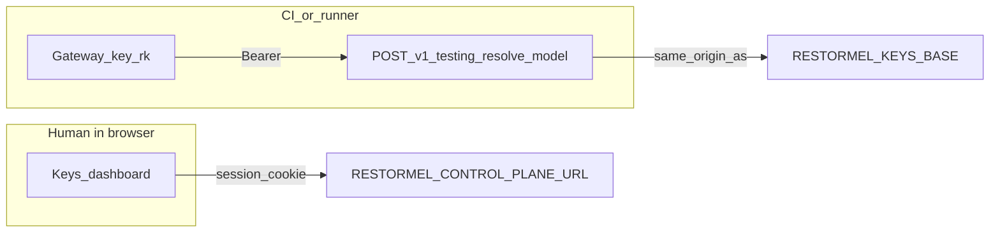

# Restormel environment vocabulary (canonical)

**Canonical** naming for `RESTORMEL_*` environment variables and dashboard URLs when integrating applications, CI, MCP, and internal admin tools.

**Do not duplicate** this table in other docs as an alternate source of truth. Link here instead: `docs/guides/restormel-environment-vocabulary.md` (repo) or in-product [Environment vocabulary](https://restormel.dev/keys/docs/guides/environment-vocabulary).

**See also:** end-to-end Keys + Testing setup (project IDs, Connections, CLI): [keys-testing-onboarding.md](keys-testing-onboarding.md). Self-host database (Neon recommended): [database-neon-for-self-hosters.md](database-neon-for-self-hosters.md) — [published guide](https://restormel.dev/keys/docs/guides/database-neon-for-self-hosters).

---

## Rules for implementers and code generators

1. **Use only the names below** for new env templates, wizards, and documentation. Avoid introducing synonyms (“Restormel API URL”, “policy URL”, “MCP base”) without mapping them explicitly to a canonical variable in your UI copy.
2. **One Gateway key, two legal env names:** `RESTORMEL_GATEWAY_KEY` and `RESTORMEL_SERVER_TOKEN` hold the **same secret** (the project Gateway key, `rk_…`) unless you deliberately issue a separate management token. Prefer setting **both** to the same value when a tool expects `RESTORMEL_SERVER_TOKEN` (e.g. MCP control-plane tools). Do **not** invent a third name for that same key.
3. **Three URL roles — never interchangeable:**
   - **Site origin** → `RESTORMEL_KEYS_BASE`
   - **Dashboard app base** (for `/api/projects/…`) → `RESTORMEL_CONTROL_PLANE_URL`
   - **Policy evaluate endpoint** (full `POST` URL) → `RESTORMEL_EVALUATE_URL`
4. **CI secret names** often use a `*_STAGING` suffix in GitHub; workflow `env` must still expose **canonical** names (`RESTORMEL_GATEWAY_KEY`, etc.) to application code. The suffix is a **secret-store convention**, not a second vocabulary for runtime.

---

## Canonical variables (runtime names)

| Name | Role | Value shape (hosted example) | Do not confuse with |
|------|------|------------------------------|---------------------|
| `RESTORMEL_GATEWAY_KEY` | Project **Gateway key**; `Authorization: Bearer` for Dashboard API (evaluate, resolve, routes/steps, …) | `rk_…` | Generic “API key”; Zuplo consumer `zpka_…` (different product surface) |
| `RESTORMEL_SERVER_TOKEN` | **Same value as** `RESTORMEL_GATEWAY_KEY` for almost all integrations; names “server-side automation / MCP control-plane” intent | same `rk_…` | A second secret unless you explicitly use a management token |
| `RESTORMEL_PROJECT_ID` | Restormel project UUID | UUID | Workspace id, Zuplo project id |
| `RESTORMEL_ENVIRONMENT_ID` | **One** environment slot (e.g. development vs production) **inside** the project | UUID | “Deployment id” without linking to Restormel’s environment row |
| `RESTORMEL_KEYS_BASE` | **Site origin only**: scheme + host, **no path** | `https://restormel.dev` | `RESTORMEL_CONTROL_PLANE_URL` or `RESTORMEL_EVALUATE_URL` |
| `RESTORMEL_CONTROL_PLANE_URL` | Dashboard **application** base: path must include `/keys/dashboard`, **no trailing slash**; append `/api/projects/{id}/…` | `https://restormel.dev/keys/dashboard` | `RESTORMEL_KEYS_BASE` alone; evaluate URL |
| `RESTORMEL_EVALUATE_URL` | **Full** URL for `POST` policy evaluation on the Dashboard API | `https://restormel.dev/keys/dashboard/api/policies/evaluate` | Control-plane base (missing `/api/policies/evaluate`) |

**Hosted path recap**

- `RESTORMEL_KEYS_BASE` = `https://restormel.dev`
- `RESTORMEL_CONTROL_PLANE_URL` = `https://restormel.dev/keys/dashboard`
- `RESTORMEL_EVALUATE_URL` = `https://restormel.dev/keys/dashboard/api/policies/evaluate`

Self-host: replace host; keep the same **path suffixes** after origin.

---

## Why two names for the Gateway key?

| Name | When to read it in docs / tools |
|------|----------------------------------|
| `RESTORMEL_GATEWAY_KEY` | Cloud API, evaluate, resolve, CLI, “Copy .env snippet” on Access |
| `RESTORMEL_SERVER_TOKEN` | MCP `routes.*` / `policies.*`, some admin wizards; emphasizes server-only use |

**Implementation note:** `@restormel/mcp` accepts **either** variable for the same Bearer token on control-plane calls. Plot-style wizards that only expose “server token” should still set **`RESTORMEL_SERVER_TOKEN` to the Gateway key value** and ideally set **`RESTORMEL_GATEWAY_KEY` to the same value** for consistency.

---

## Testing runner (`POST …/v1/testing/resolve-model`)

The **Restormel Testing** CLI and `@restormel/testing-keys-adapter` call the Keys HTTP resolve endpoint with a **Gateway key** (`rk_…`) as `Authorization: Bearer`, on the **same origin** as the public site (hosted: typically `RESTORMEL_KEYS_BASE`).

**Prefer these names** in new `.env` files, CI snippets, and docs:

| Canonical | Role |
|-----------|------|
| `RESTORMEL_KEYS_BASE` | Site origin (scheme + host, no path); base for `…/v1/testing/resolve-model` |
| `RESTORMEL_GATEWAY_KEY` | Bearer token for that request (same secret as elsewhere) |
| `RESTORMEL_PROJECT_ID` | Project UUID (from the **Restormel Testing** hub) |

**Compatibility aliases** (older Testing docs and snippets; same values as the row above):

| Alias | Same as |
|-------|---------|
| `RESTORMEL_KEYS_API_BASE_URL` | `RESTORMEL_KEYS_BASE` |
| `RESTORMEL_KEYS_API_TOKEN` | `RESTORMEL_GATEWAY_KEY` |

**Precedence in `@restormel/testing-keys-adapter`:** Base URL is `RESTORMEL_KEYS_API_BASE_URL` if set, otherwise `RESTORMEL_KEYS_BASE`. Bearer token resolution: optional `RESTORMEL_KEYS_API_TOKEN_ENV` names a custom env var and is tried first; then `RESTORMEL_KEYS_API_TOKEN`; then `RESTORMEL_GATEWAY_KEY`; then `RESTORMEL_SERVER_TOKEN`.

Trust boundaries (browser vs automation) at a glance:



End-to-end checklist: [keys-testing-onboarding.md](keys-testing-onboarding.md).

---

## CI and GitHub Actions (`*_STAGING`)

Repository secrets are often named:

- `RESTORMEL_GATEWAY_KEY_STAGING`
- `RESTORMEL_PROJECT_ID_STAGING`
- `RESTORMEL_ENVIRONMENT_ID_STAGING`
- `RESTORMEL_KEYS_BASE_STAGING`
- `RESTORMEL_EVALUATE_URL_STAGING`
- `RESTORMEL_CONTROL_PLANE_URL_STAGING`
- `RESTORMEL_SERVER_TOKEN_STAGING` (same value as Gateway key when used)

In the workflow, map them to **canonical** runtime names, for example:

```yaml
env:
  RESTORMEL_GATEWAY_KEY: ${{ secrets.RESTORMEL_GATEWAY_KEY_STAGING }}
  RESTORMEL_SERVER_TOKEN: ${{ secrets.RESTORMEL_SERVER_TOKEN_STAGING }}  # optional if same as above
  RESTORMEL_PROJECT_ID: ${{ secrets.RESTORMEL_PROJECT_ID_STAGING }}
  # …
```

The dashboard **Copy full CI snippet** on the project page emits both `*_STAGING` and an unprefixed block for local `.env` and wizards; values must match this document.

---

## Mapping informal UI labels (admin wizards)

If your product exposes a “setup wizard”, map fields **to canonical names** in saved config:

| Wizard label (example) | Canonical variable(s) |
|--------------------------|------------------------|
| Restormel site / “main URL” / marketing host | `RESTORMEL_KEYS_BASE` |
| Control-plane / dashboard API / “MCP base” | `RESTORMEL_CONTROL_PLANE_URL` |
| Policy evaluate / entitlements URL | `RESTORMEL_EVALUATE_URL` |
| Gateway key / API key (Restormel) | `RESTORMEL_GATEWAY_KEY` |
| Server token (optional) | `RESTORMEL_SERVER_TOKEN` (= same as Gateway key unless separate token) |
| Project ID | `RESTORMEL_PROJECT_ID` |
| Environment ID | `RESTORMEL_ENVIRONMENT_ID` |

---

## MCP stdio server (extra variables)

Provider keys and local entitlement config are documented in **`packages/mcp/README.md`** (`RESTORMEL_MCP_CONFIG`, `RESTORMEL_MCP_<PROVIDER>_KEY`, etc.). Those names are **additive**; they do not replace the canonical URL and Gateway variables above.

**Operational journey** (checklists, verification): [runbooks/mcp-implementation-workflow.md](../runbooks/mcp-implementation-workflow.md).

---

## Security and logging

Never log raw Gateway keys or tokens. Trust boundaries: [security-baseline.md](../governance/security-baseline.md).

---

## Related in-product pages

- [MCP integration](https://restormel.dev/keys/docs/integrations/mcp)
- [Cloud API](https://restormel.dev/keys/docs/cloud-api) (Policy evaluate)
- [Developer Tools → MCP](https://restormel.dev/keys/dashboard/dev-tools/mcp)
