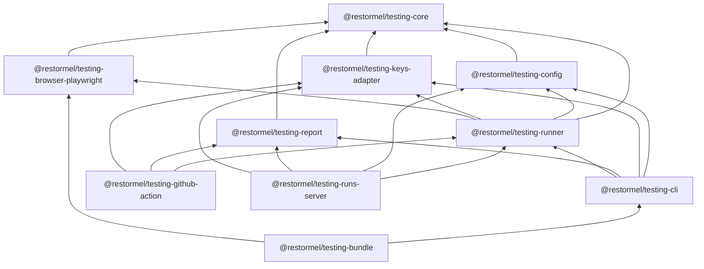

# Restormel monorepo — package map

**Canonical repo:** [restormel-keys](https://github.com/Allotment-Technology-Ltd/restormel-keys) (Keys product, Testing runner, tokens source, dashboard, integrations).

End users consume **published npm packages**; this document is for contributors.

## Workspace layout

| Path | npm scope / app | Role |
|------|-----------------|------|
| `packages/keys-tokens` | `@restormel/keys-tokens` | Design tokens + CSS entrypoints; publish tag **`tokens-v*`** |
| `packages/core` | `@restormel/keys` | Headless BYOK core |
| `packages/svelte`, `react`, `elements` | `@restormel/keys-*` | UI adapters |
| `packages/cli` (Keys) | `@restormel/keys-cli` | Keys CLI wrapper |
| `packages/doctor`, `validate` | `@restormel/doctor`, `@restormel/validate` | OSS tooling |
| `packages/aaif`, `mcp` | `@restormel/aaif`, `@restormel/mcp` | Contracts / MCP |
| `packages/graph-core`, `packages/ui-graph-svelte` | `@restormel/graph-core`, `@restormel/ui-graph-svelte` | **Restormel Graph** — Contract v0 + contracts-free helpers; Svelte 5 canvas (ported from SOPHIA). **Public docs (dashboard):** `https://restormel.dev/graph` and `https://restormel.dev/graph/docs` (canonical integrator: `/graph/docs/integration/sveltekit`). Publish tag **`graph-v*`** → [`.github/workflows/publish-graph.yml`](../.github/workflows/publish-graph.yml). SOPHIA: [docs/restormel-graph-sophia-consumer.md](restormel-graph-sophia-consumer.md). Scope: [packages/graph-core/GRAPH_CORE_V0_SCOPE.md](../packages/graph-core/GRAPH_CORE_V0_SCOPE.md); extraction map: [docs/restormel/04-delivery/restormel-graph-sophia-extraction-artifacts.md](restormel/04-delivery/restormel-graph-sophia-extraction-artifacts.md) |
| `packages/contracts`, `packages/observability`, `packages/graph-reasoning-extensions`, `packages/context-packs` | `@restormel/contracts`, `@restormel/observability`, `@restormel/graph-reasoning-extensions`, `@restormel/context-packs` | **Phase 1 platform** (+ **Phase 2 context packs**) — Zod contracts + trace/event shaping + reasoning graph extensions (compare, lineage, projection, …). **`@restormel/context-packs`** is dependency-free: pass-specific LLM context text from a portable retrieval-shaped payload. Publish tag **`platform-v*`** → [`.github/workflows/publish-restormel-platform.yml`](../.github/workflows/publish-restormel-platform.yml). Phase 1 spec: [docs/restormel/phase1-restormel-engineering-spec.md](restormel/phase1-restormel-engineering-spec.md). Context packs: [docs/restormel/PHASE2-EXTRACTION-STATUS.md](restormel/PHASE2-EXTRACTION-STATUS.md). |
| `packages/testing-core` … `testing-github-action`, `packages/testing-runs-server`, `packages/restormel-testing` | `@restormel/testing-*`, `@restormel/testing-bundle` | Goal-based testing runner, CLI, optional HTTP **Runs API** server (`testing-runs-server`), meta-package (`testing-bundle`), composite Action; publish tag **`testing-v*`** (or workflow dispatch). Config JSON Schema draft: `packages/testing-config/schema/restormel-testing-config.v1.schema.json` |
| `apps/dashboard` | `dashboard` (private) | Keys marketing + dashboard SvelteKit app (**Connections**, **Restormel Testing** hub, encrypted provider credentials); Testing marketing/docs at **`/testing`** (`src/routes/testing/`) |
| `apps/restormel-graph-demo` | `restormel-graph-demo` (private) | SvelteKit demo: **`/dev/graph-portability`** mock **`GraphData`** + **`GraphCanvas`** |
| `platform/` | (mostly non-published) | Cursor template, module scaffold mirror, shared composite copies |

## @restormel/testing-* dependency graph

`@restormel/testing-bundle` is a thin **meta-package** (CLI + browser adaptor dependency) for consumers who want one `pnpm add -D` line; it contains no runtime code.

**Keys adapter:** `@restormel/testing-keys-adapter` calls `POST …/v1/testing/resolve-model` with the Gateway bearer; the response may include an **inline** provider key when the Keys deployment stores encrypted credentials for the binding (`RESTORMEL_HOSTED_INLINE`). See [keys-testing-onboarding.md](../keys-testing-onboarding.md).

## Build / test commands (root)

- **Testing TypeScript:** `pnpm run build:testing-packages` (`tsconfig.testing-packages.json`)
- **Testing unit tests:** `pnpm run test:testing`
- **Testing in dashboard (svelte-check):** `pnpm --filter dashboard run check` (already part of `check:dashboard`; included in `check:testing` via `typecheck:testing-dashboard`)
- **Full testing gate:** `pnpm run check:testing`

## Historical repos

Content previously in **restormel-testing** and **restormel-platform** (tokens) now lives here. Do not treat those repositories as authoritative for new work.
