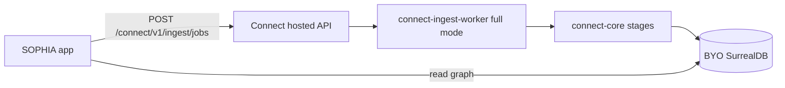

# SOPHIA → Connect ingest cutover

Single pipeline truth: SOPHIA staging wave-1 moves from local `scripts/ingest.ts` to Connect hosted REST + shared `@restormel/connect-core` quality package.

## Target architecture

## Cutover phases

| Phase | SOPHIA | Connect | Parity check |
|-------|--------|---------|--------------|
| **Wave 0 (now)** | Dual-write optional | Production preset default, quality report, kg trust v1 | Golden fixture fingerprint in CI |
| **Wave 1 staging** | `ingestion_jobs` POST to Connect REST | Full worker + cross-model validation | Golden metrics ± agreed delta vs SOPHIA |
| **Wave 2 prod** | Thin client only | Single codepath | G1–G4 green on philosophy + one template pack |

## SOPHIA changes (wave 1)

1. Replace direct `scripts/ingest.ts` job enqueue with `POST /keys/dashboard/api/connect/ingest/jobs` (or public `/connect/v1/ingest/jobs` with workspace token).
2. Pass `domain_pack_id` for philosophy pack; `quality_preset: production` implicit.
3. Poll job status; surface Connect **Quality report** in admin instead of bespoke stats.
4. Retain Surreal as graph store — Connect writes to configured BYO target.

## Connect responsibilities (already shipped)

- `@restormel/connect-core` — extract, validate, remediate, pre-scan, golden eval, kg trust score
- Production preset — mandatory validate/remediate, chunk caps, zero-unit guard
- Graph explorer quarantine queue — `review_state` + `isAwaitingHumanTriage`

## Rollback

Keep SOPHIA `scripts/ingest.ts` behind `CONNECT_INGEST_CUTOVER=0` env until wave-1 parity doc is signed.

## Sign-off checklist

- [ ] Philosophy golden URLs ingest with ≥90% `ok` after remediation
- [ ] Trust score ≥85 post-ingest on reference corpus
- [ ] No stub-complete production jobs with zero units
- [ ] Retrieval benchmark non-regression vs archived SOPHIA artifact
