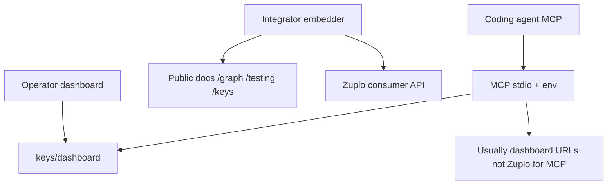

# Theme L — product × surface IA matrix

**Purpose:** Repeatable map of where each Restormel product appears across **marketing**, **public docs**, **signed-in dashboard**, **Zuplo gateway / developer portal**, and **MCP** (`@restormel/mcp`). Use this when adding features so navigation and vocabulary stay aligned with [documentation-strategy.md](../documentation-strategy.md).

**Related:** [THEME-L-DASHBOARD-EPIC-TEMPLATE.md](./THEME-L-DASHBOARD-EPIC-TEMPLATE.md), [HORIZON-PLATFORM-PROGRAMME.md](./HORIZON-PLATFORM-PROGRAMME.md), [THEME-L-MCP-PARITY.md](./THEME-L-MCP-PARITY.md).

---

## Horizon implementation phases (naming)

**Horizon Phase 1** means **Theme L + suite MCP/AAIF** (this matrix, MCP read tools, AAIF parity). It is **not** the same document as [phase1-restormel-engineering-spec.md](./phase1-restormel-engineering-spec.md) (platform package extraction: contracts, graph-core, etc.).

---

## User journeys (overview)

---

## Matrix

| Product | Marketing / entry | Public docs (DocsShell) | Signed-in dashboard (`apps/dashboard`) | Zuplo / gateway | MCP grouping |
|--------|-------------------|-------------------------|----------------------------------------|-----------------|--------------|
| **Keys** | `https://restormel.dev/keys` | `https://restormel.dev/keys/docs` — nav: [`SiteHeader`](../../apps/dashboard/src/lib/components/site/SiteHeader.svelte) / docs layout | `/keys/dashboard` — sidebar [`nav-config.ts`](../../apps/dashboard/src/lib/nav-config.ts): Set Up, Monitor, Advanced | **Consumer API:** gateway URL from Portal; **Developer portal:** Zuplo project docs — setup [zuplo-setup.md](../runbooks/zuplo-setup.md), [zuplo-gateway/docs](https://github.com/Allotment-Technology-Ltd/restormel-keys/tree/main/zuplo-gateway/docs) | Keys + control plane: `models.*`, `routes.*`, `policies.*`, `projects.*`, `project.*`, `providers.*`, `cost.*`, `routing.*`, `entitlements.*`, `integration.*`, `byok.*`, `catalog.*`, `readiness.*`, `policy.simulate`, `docs.search`, `docs.canonical_resolve` |
| **Restormel Testing** | `https://restormel.dev/testing` | `https://restormel.dev/testing/docs` — [`testing/docs-nav.ts`](../../apps/dashboard/src/lib/testing/docs-nav.ts) | **Testing hub:** `/keys/dashboard/testing` (canonical; see documentation-strategy) | Same Cloud API surface as Keys where resolve-model applies; CI uses env + CLI | `testing.*`, `testing.config_validate` |
| **Restormel Graph** | `https://restormel.dev/graph` | `https://restormel.dev/graph/docs` — [`graph/docs-nav.ts`](../../apps/dashboard/src/lib/graph/docs-nav.ts) | No separate Graph operator shell in dashboard v1; demo: `apps/restormel-graph-demo` | N/A for v1 canvas | `graph.fixture_validate` (suite tool) |
| **Integrations / AAIF / MCP** | `https://restormel.dev/integrations` | `/keys/docs/integrations/*` | **Dev Tools:** `/keys/dashboard/dev-tools` (CLI, MCP, AAIF tabs) | [integrations-mcp.md](../../zuplo-gateway/docs/pages/integrations-mcp.md) — env URL shapes vs dashboard | All suite tools; agent setup runbook [mcp-implementation-workflow.md](../runbooks/mcp-implementation-workflow.md) |
| **Platform libs** (contracts, observability, context-packs, state) | Linked from Graph docs **Extensions** | e.g. `/graph/docs/extensions/state` | No dedicated hub; future operator views use [THEME-L-DASHBOARD-EPIC-TEMPLATE.md](./THEME-L-DASHBOARD-EPIC-TEMPLATE.md) | N/A | `observability.trace_summarize`, `state.memory_preview`, `docs.canonical_resolve` topics |
| **Restormel Support (Theme M)** | **Support** FAB (signed-in) | [RESTORMEL-SUPPORT.md](./RESTORMEL-SUPPORT.md) | **Site-wide** signed-in shell (root layout) + `POST …/support-chat`; not a second nav tree | N/A | Doc index shared with `docs.search`; see [HORIZON-PLATFORM-PROGRAMME.md §5](./HORIZON-PLATFORM-PROGRAMME.md) |

**Canonical URLs** for Dashboard and Testing hub:** [documentation-strategy.md](../documentation-strategy.md) (same-links table).

**Code anchors**

- Dashboard nav: [`apps/dashboard/src/lib/nav-config.ts`](../../apps/dashboard/src/lib/nav-config.ts)
- Keys docs sidebar: routes under `apps/dashboard/src/routes/keys/docs/`
- Zuplo repo subtree: [`zuplo-gateway/`](../../zuplo-gateway/) (`config/routes.oas.json`, `config/policies.json`, portal MDX)

---

## Rules (summary)

1. Extend **existing** nav trees; do not fork a second top-level IA per product.
2. **Integrator-only** depth → Graph/Testing public docs; **operator mechanics** without custom host UI → `keys/dashboard`.
3. **MCP tool names and descriptions** use the same vocabulary as dashboard labels (Gateway key, Restormel Testing, Rules, Guard Rails, …).
