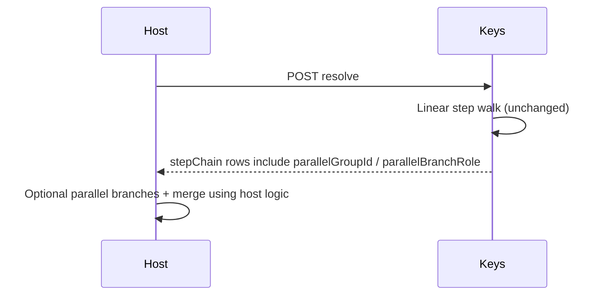

# Resolver sequence: parallel metadata (v1 informational)

**Audience:** Integrators using `parallel_group_id` / `parallel_branch_role` on steps.  
**Contract:** `contractVersion` **`2026-04-16`** — see [keys-routing-contract.md](../architecture/keys-routing-contract.md).

## v1 behaviour

- Keys **still** walks enabled steps in **linear** `orderIndex` order for selection (first winning step after policy + executable checks).
- `parallel_group_id` and `parallel_branch_role` are **echoed** on `stepChain`, simulate `stepDiagnostics` / `routingAttempts`, and `perStepEstimates` so hosts can implement **fan-out / fan-in** in the data plane.
- **Merge semantics** (`all_succeed`, `first_wins`, …) are **not** evaluated in Keys in v1; hosts choose strategy explicitly.

## Sequence (metadata only)

