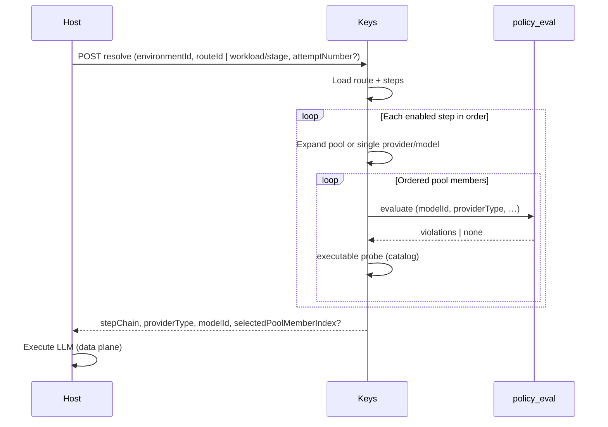

# Resolver sequence: model pools (Keys → host)

**Audience:** Integrators implementing `POST …/resolve` consumers.  
**Contract:** `contractVersion` **`2026-04-16`** — see [keys-routing-contract.md](../keys-routing-contract.md).

## Roles

- **Keys:** Reads `route_steps.model_pool` JSON (v1), orders members by `selectionStrategy`, evaluates **policies per member** in order, picks the **first** member that passes policy and is executable (provider + model), and returns that choice in `providerType` / `modelId` and `stepChain` (with `poolMembers`, `poolMemberIndex` when applicable).
- **Host:** Executes the LLM call using the resolved provider/model; Keys does **not** call providers.

## Sequence

Policies apply to **each candidate member** until one passes; there is no separate “whole pool” allow/deny in v1 beyond per-member evaluation.
