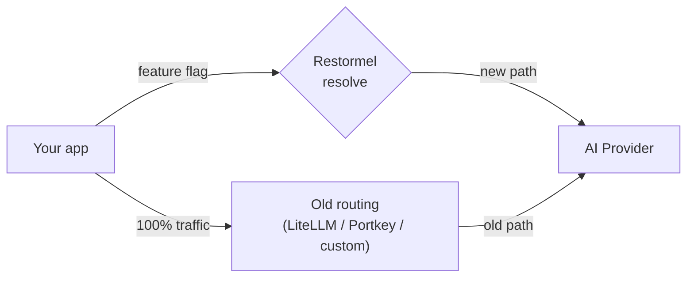
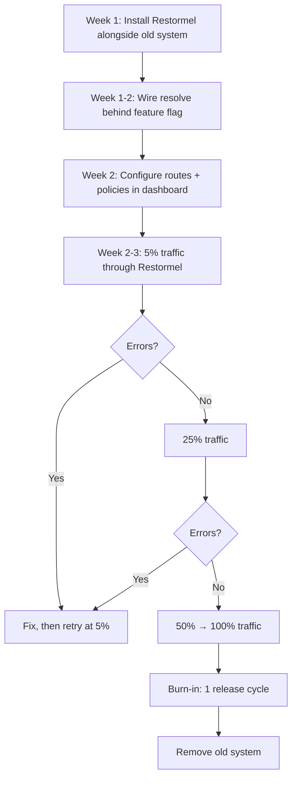

# Migration Paths

> **Time:** Varies by source system
> **Prerequisites:** Familiarity with your current routing system, a Restormel Keys account
> **You'll need:** Access to your current gateway/proxy config, your app's codebase, and the [Dashboard](/keys/dashboard)

This page covers migration from four starting points: custom routing code, LiteLLM, Portkey, and OpenRouter. Each variant follows the same principle: **strangler pattern** — run old and new in parallel, shift traffic incrementally, verify, then retire the old system.

The walkthrough phases (0–6) are framework-agnostic. This page maps each migration source to the phases, highlights what's different, and provides source-specific prompts.

---

## Migration principle: the strangler pattern

1. **Install** Restormel Keys alongside your existing system (Phase 1). Nothing changes yet.
2. **Wire** the resolve call behind a feature flag (Phase 2). Old system still handles 100%.
3. **Shift** a small percentage of traffic to Restormel (Phase 6, Step 6.2). Both systems run.
4. **Verify** — compare outcomes, latency, and errors between old and new paths.
5. **Cut over** — move all traffic to Restormel. Old system is idle.
6. **Remove** — decommission the old system after a burn-in period.

At no point do you rip out the old system before the new one is proven. The feature flag (Phase 0, Step 0.5) is your safety net throughout.

---

## Variant A: "I have custom routing code"

This is the default path the walkthrough is written for. Your app has bespoke `if/else`, config files, or a small routing module that picks providers.

**What's different:** Nothing. Follow Phases 0–6 as written.

**Phase mapping:**

| Phase | What you do |
|-------|------------|
| 0 | Inventory your custom files (router, fallback, model picker, BYOK settings) |
| 1 | Install packages, create project |
| 2 | Wire resolve alongside your custom router via feature flag |
| 3 | Move your fallback chain config into dashboard routes |
| 4 | Move your model allowlists into dashboard policies |
| 5 | Replace your custom model picker with ModelSelector |
| 6 | Shift traffic, verify, remove custom code |

**Key risk:** Custom routing code is often spread across many files with implicit dependencies. Phase 0 (inventory) is especially important — don't skip it.

---

## Variant B: "I'm using LiteLLM"

LiteLLM is a proxy server that normalises provider APIs. You call LiteLLM's endpoint and it forwards to the configured provider. Common setup: Docker container running `litellm --model gpt-4o`, with a `litellm_config.yaml` defining models, fallbacks, and provider keys.

**What Restormel replaces:**
- LiteLLM's routing and fallback logic → Restormel routes and steps
- LiteLLM's model config (`litellm_config.yaml`) → Restormel dashboard (routes, policies, model catalog)
- LiteLLM's proxy endpoint → your app calls providers directly using the resolve result

**What Restormel does NOT replace:**
- LiteLLM's request/response normalisation (if you depend on its unified schema). If you need this, keep LiteLLM as a normalisation layer and have Restormel decide _which_ model LiteLLM should use.

**Phase mapping:**

| Phase | LiteLLM-specific notes |
|-------|----------------------|
| 0 | Inventory: your `litellm_config.yaml`, the Docker/process setup, and every place your app calls `http://localhost:4000/chat/completions` (or equivalent). Classify the LiteLLM proxy as "REMOVE" (if you want to call providers directly) or "WRAP" (if you want to keep LiteLLM as a normalisation layer with Restormel doing routing). |
| 1 | Install Restormel packages. No change to LiteLLM yet. |
| 2 | Wire Restormel resolve. If keeping LiteLLM: resolve returns the model, and you pass that model to LiteLLM. If removing LiteLLM: resolve returns the provider, and you call the provider SDK directly. |
| 3 | Translate `litellm_config.yaml` fallback settings into dashboard routes. Each LiteLLM fallback model becomes a step in a Restormel route. |
| 4 | Translate any LiteLLM `allowed_models` or budget settings into Restormel policies. |
| 5 | If LiteLLM had no UI, this is net-new. If it did, replace with Restormel ModelSelector. |
| 6 | Shift traffic. When 100% is on Restormel: stop the LiteLLM container, remove `litellm_config.yaml`, remove Docker/process config. |

### Build-agent prompt: migrate-from-litellm

**Context docs** (adapt paths for your project): this page (Variant B); [Phase 0 — Inventory](/keys/docs/walkthrough/phase-0-inventory) (inventory framework); [Phase 3 — Routes](/keys/docs/walkthrough/phase-3-routes) (route/step model); [Phase 4 — Policies](/keys/docs/walkthrough/phase-4-policies) (policy types).

**Prompt:**

> You are working in [your app repo] which currently uses LiteLLM for AI provider routing.
>
> **Goal:** Inventory the LiteLLM integration and produce a migration plan to Restormel Keys.
>
> **Steps:**
>
> 1. Locate the LiteLLM config: `litellm_config.yaml`, `litellm_settings`, Docker Compose file, or equivalent.
> 2. Extract: list of models, fallback order, any `allowed_models` or `blocked_models`, budget/rate-limit settings, provider API keys (note which env vars — do not copy the values).
> 3. Locate every place in the codebase that calls the LiteLLM proxy endpoint (e.g. `http://localhost:4000/chat/completions` or `LITELLM_BASE_URL`).
> 4. For each LiteLLM feature, map to the Restormel equivalent:
>    - LiteLLM model list → Restormel route steps
>    - LiteLLM fallback models → Restormel route with `fallback_chain` mode
>    - LiteLLM `allowed_models` → Restormel `model_allowlist` policy
>    - LiteLLM budget → Restormel `budget_cap` policy
>    - LiteLLM provider keys → Restormel provider credentials (or keep in your own env)
> 5. Decide: remove LiteLLM entirely (call providers directly) or keep LiteLLM as normalisation layer (Restormel decides the model, LiteLLM handles the request format).
> 6. Write the migration plan to `docs/restormel-integration/01-litellm-migration.md`.
>
> **DO NOT:**
> - Remove LiteLLM or its config yet. This is a plan only.
> - Copy real API keys into the migration doc.
> - Assume LiteLLM features that aren't actually configured (check the config file).

**Gate:** A migration plan document exists mapping every LiteLLM feature to its Restormel equivalent, with a decision on whether to keep LiteLLM as a normalisation layer or remove it entirely.

---

## Variant C: "I'm using Portkey"

Portkey is a gateway with routing, fallbacks, caching, and observability. You call Portkey's endpoint with a config header that specifies routing strategy.

**What Restormel replaces:**
- Portkey's routing configs → Restormel routes and steps
- Portkey's fallback strategies → Restormel `fallback_chain` route mode
- Portkey's model restrictions → Restormel policies

**What Restormel does NOT replace:**
- Portkey's request caching (if you use it, you'll need a separate caching layer)
- Portkey's observability/tracing (Restormel is not an observability tool — use your existing tracing)

**Phase mapping:**

| Phase | Portkey-specific notes |
|-------|----------------------|
| 0 | Inventory: Portkey configs (JSON headers or API configs), the Portkey API key, every place your app calls `https://api.portkey.ai/v1/...` or uses the Portkey SDK. |
| 1 | Install Restormel packages alongside Portkey. |
| 2 | Wire Restormel resolve. Your app calls resolve first, then makes the provider call directly (instead of through Portkey). Feature flag gates which path runs. |
| 3 | Translate Portkey routing configs (provider order, fallback strategy) into dashboard routes with steps. |
| 4 | Translate any Portkey model restrictions or budget controls into Restormel policies. |
| 5 | Embed Restormel UI. Portkey has no embeddable BYOK UI — this is net-new. |
| 6 | Shift traffic. When 100% is on Restormel: remove Portkey SDK, delete Portkey API key, cancel Portkey subscription if applicable. |

**Key difference from LiteLLM:** Portkey configs are typically JSON objects passed as headers or configured via their dashboard/SDK. You'll need to extract the routing logic from those configs manually.

---

## Variant D: "I'm using OpenRouter"

OpenRouter is a unified API that routes requests to multiple providers with a single endpoint. You call `https://openrouter.ai/api/v1/chat/completions` with a model name, and OpenRouter handles provider selection.

**What Restormel replaces:**
- OpenRouter's implicit provider routing → Restormel explicit routes and steps (you control _exactly_ which provider handles each model)
- OpenRouter's model selection → Restormel ModelSelector with policy constraints

**What Restormel does NOT replace:**
- OpenRouter's access to providers you don't have direct accounts with. If you use OpenRouter because it gives you access to models you can't get directly, you may want to keep OpenRouter as a provider _within_ Restormel's routing (i.e. a step in a route that calls OpenRouter).

**Phase mapping:**

| Phase | OpenRouter-specific notes |
|-------|--------------------------|
| 0 | Inventory: every place your app calls the OpenRouter API, the OpenRouter API key, any model-specific logic. |
| 1 | Install Restormel packages. Set up direct provider accounts (OpenAI, Anthropic, Google) for the models you use — or keep OpenRouter as a "provider" in your route. |
| 2 | Wire resolve. The resolve result tells you which provider to call. If keeping OpenRouter as a provider, add it as a custom provider in your config. |
| 3 | Create routes. If you previously relied on OpenRouter to pick the cheapest provider for a given model, replicate that as explicit route steps (e.g. Step 1: OpenAI for gpt-4o, Step 2: OpenRouter for gpt-4o as fallback). |
| 4 | Add policies. OpenRouter has no policy concept — this is net-new governance. |
| 5 | Embed ModelSelector. OpenRouter has no embeddable UI — this is net-new. |
| 6 | Shift traffic. When 100% is on Restormel: remove OpenRouter SDK/API calls, revoke OpenRouter API key if no longer needed. |

**Key difference:** OpenRouter abstracts away provider choice entirely. Moving to Restormel means you're taking explicit control of which provider handles each request. This is more work but gives you full visibility and policy control.

---

## Comparison: what each source gives you that Restormel doesn't

| Feature | LiteLLM | Portkey | OpenRouter | Restormel approach |
|---------|---------|---------|------------|-------------------|
| Request/response normalisation | Yes (proxy) | Yes (proxy) | Yes (proxy) | No — call providers directly with their SDKs. Use Restormel for routing decisions only. |
| Request caching | Plugin | Yes | No | Not in scope — use a caching layer (Redis, CDN, etc.) |
| Observability / tracing | Plugin | Yes | Basic | Not in scope — use your existing tracing (PostHog, Datadog, etc.) |
| Access to providers you don't have accounts with | No | No | Yes | No — you need direct provider accounts (or keep OpenRouter as a step in a route) |
| Embeddable BYOK UI | No | No | No | **Yes** — KeyManager, ModelSelector |
| Policy enforcement (allowlists, budgets) | Partial | Partial | No | **Yes** — first-class policies in the dashboard |
| Library-first (no proxy/container) | SDK only | No | No | **Yes** — headless core, no infrastructure required |

---

## The safe strangler approach in detail

Regardless of your source system, the strangler approach follows the same sequence:

**Timeline:** Most teams complete the migration in 2–3 weeks. The burn-in period before removing the old system is typically one release cycle (1–2 weeks).

**Rollback at any point:** Flip the feature flag to `false` and 100% of traffic returns to the old system instantly. No code change, no deployment — just an env var.

---

## Checkpoint

You now have:

- A clear mapping from your source system (custom, LiteLLM, Portkey, or OpenRouter) to the walkthrough phases.
- A strangler approach that lets you migrate incrementally with instant rollback.
- Source-specific notes on what Restormel replaces and what it doesn't.
- (If LiteLLM) A build-agent prompt for producing a migration plan document.

**Next:** [Verification strategy](/keys/docs/walkthrough/verification-strategy) — ongoing checks for dashboard, CLI, and smoke tests after integration.
